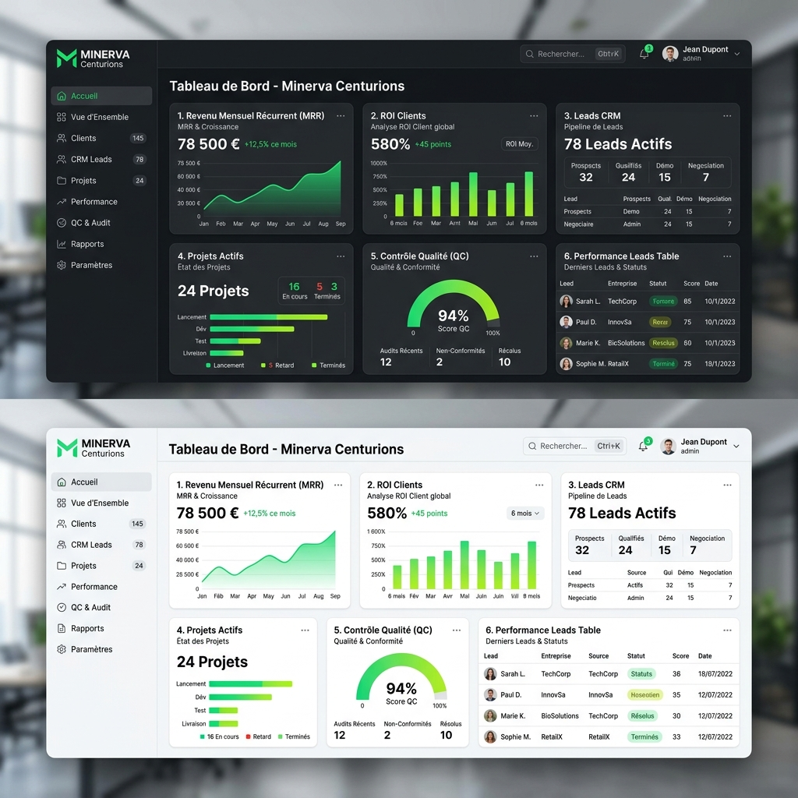

<div align="center">

# Minerva Trequartista (v2.13.0)

**Système d'exploitation de livraison client, de suivi du ROI et d'excellence opérationnelle de l'agence Minerva**

---

[](https://nextjs.org/)
[](https://www.typescriptlang.org/)
[](https://supabase.com/)
[](https://github.com/Endsi3g/The-Trequartista-from-Minerva)

<br />



---

</div>

## 🌐 Écosystème des Applications Minerva

| Application | Description & Rôle | Lien d'Accès |
| :--- | :--- | :--- |
| **Minerva Trequartista** | ERP Central : Gestion de projets, CRM Leads, Facturation, Chat d'équipe, SOPs & Console Tech | [app.minerva.agency](https://app.minerva.agency) |
| **Minerva OS Lite** | App de prospection & closing terrain : Routine quotidienne `/today`, qualification express de fiches commerces | [minerva-os-lite-desktop.vercel.app/today](https://minerva-os-lite-desktop.vercel.app/today) |
| **Minerva Flow** | Produit SaaS client : Commande en ligne directe, QR code sur table et encaissement Stripe à 0% de commission | [minerva-flow.vercel.app/login](https://minerva-flow.vercel.app/login) |
| **Composio Hosted MCP** | Hub d'outils et connecteurs API pour agents d'ingénierie et automatisations | [connect.composio.dev/mcp](https://connect.composio.dev/mcp) |

---

## ⚡ Modules Applicatifs

- **Vue d'Ensemble Multi-Workspace** : Tableaux de bord dynamiques adaptés aux rôles (*Prospection*, *Managing*, *Tech*).
- **Propositions Commerciales & Signature Électronique** : Constructeur de devis avec acompte Stripe 50%, calcul automatique TPS/TVQ et signature tactile Canvas.
- **Moteur RevOps & Commissions d'Équipe** : Calcul automatique des commissions (10% Setup Studio + 5% récurrent MRR) avec multiplicateur quota 1.25x et approbation en 1 clic.
- **Messagerie d'Équipe Temps Réel** : Canaux thématiques (`#général`, `#annonces`), autocomplétion des mentions `@all` / `@equipe` et notifications natives du navigateur avec carillon Web Audio.
- **Console Tech & Ingénierie** : Command center haute densité, ruban de télémétrie 4-colonnes, création rapide de tâches (touche `C`) et matrice QA 20-points obligatoire (`QualityChecklistRunner`).
- **Académie & Base de Connaissances** : SOPs complètes sur le workflow GitHub, la création de sites clients Framer et le développement de fonctionnalités Next.js/Supabase.

---

## 🚀 Déploiement 1-Clic de la Base de Données

Le schéma complet de production est condensé dans un script unique, idempotent et testé :
```bash
# Fichier SQL consolidé maître :
supabase/deploy_production_complete.sql
```
1. Ouvrez le [SQL Editor Supabase](https://supabase.com/dashboard/project/_/sql).
2. Collez le contenu de `supabase/deploy_production_complete.sql`.
3. Cliquez sur **Run** pour initialiser l'ensemble des tables, politiques RLS, triggers et données initiales.

---

## 🛠️ Installation & Démarrage Local

```bash
# 1. Cloner le dépôt
git clone https://github.com/Endsi3g/The-Trequartista-from-Minerva.git
cd The-Trequartista-from-Minerva

# 2. Installer les dépendances
npm install
# ou pnpm install

# 3. Configurer l'environnement local (.env.local)
NEXT_PUBLIC_SUPABASE_URL=https://your-project.supabase.co
NEXT_PUBLIC_SUPABASE_ANON_KEY=your-anon-key
SUPABASE_SERVICE_ROLE_KEY=your-service-role-key

# 4. Lancer le serveur de développement
npm run dev
```

---

## 🧪 Validation & Tests

```bash
# Vérification TypeScript statique
npx tsc --noEmit
```
