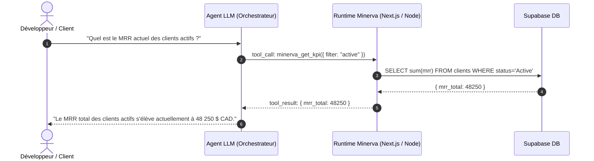

# SOP-IA-01 : Fondations du AI Engineering Moderne & Systèmes Agentiques

**Catégorie :** IA & Ingénierie  
**Public cible :** Développeurs Fullstack, Ingénieurs IA, Tech Leads Minerva  
**Temps de lecture :** 25 minutes  
**Auteur :** Équipe Technique Minerva  

---

## 1. Du Prompt Engineering au System & Context Engineering

Le passage de l'expérimentation naïve de modèles de langage (LLMs) à l'ingénierie logicielle robuste exige d'abandonner l'idée que « prompter » suffit. Le **AI Engineering** traite le modèle comme une unité de calcul probabiliste (une fonction non déterministe) devant être orchestrée dans une boucle logicielle déterministe.

```
┌───────────────────────────────────────────────────────────┐
│                    CONTEXT WINDOW                         │
│ ┌───────────────────────┬───────────────────────────────┐ │
│ │ System Instructions   │ In-Context Examples (Few-Shot)│ │
│ ├───────────────────────┼───────────────────────────────┤ │
│ │ Tool Definitions      │ Dynamic Retrieved RAG State   │ │
│ ├───────────────────────┼───────────────────────────────┤ │
│ │ Conversation History  │ User Turn & Scratchpad        │ │
│ └───────────────────────┴───────────────────────────────┘ │
└───────────────────────────────────────────────────────────┘
```

### Mécanique Fondamentale des LLMs
- **Autorégression & Tokenisation** : Les modèles génèrent du texte token par token selon la distribution de probabilité conditionnelle $P(w_t \mid w_1, \dots, w_{t-1})$.
- **Attention & Limites de Contexte** : Bien que les fenêtres de contexte modernes atteignent 128k à 2M tokens (Gemini 1.5/2.0, Claude 3.5 Sonnet, GPT-4o), le phénomène de **« Lost in the Middle »** persiste : l'attention est maximale sur le début (System prompt) et la fin immédiate du contexte.
- **Règle Minerva** : Placez toujours les contraintes non négociables et les types de retour au tout début et répétez les contraintes critiques juste avant le token de fin d'instruction.

---

## 2. Context Engineering & Sorties Structurées

Pour intégrer un LLM dans une application TypeScript / Next.js, la sortie doit être typée et validable à l'exécution.

### Typage Stricte avec Zod & JSON Schema
Tout appel de modèle générant des données métier (ex: extraction d'audit, propositions, scoring CRM) doit passer par un schéma Zod :

```typescript
import { z } from 'zod';

export const LeadAuditExtractionSchema = z.object({
  restaurant_name: z.string().min(1),
  primary_bottleneck: z.enum([
    'staff_shortage',
    'high_food_cost',
    'low_turnover',
    'delivery_margins',
  ]),
  estimated_monthly_leakage_cad: z.number().nonnegative(),
  recommended_initiatives: z.array(
    z.object({
      title: z.string(),
      pillar: z.enum(['flow', 'reach', 'agency', 'inspirations']),
      impact_score: z.number().min(1).max(10),
      effort_days: z.number().int().positive(),
    })
  ).min(1),
});

export type LeadAuditExtraction = z.infer<typeof LeadAuditExtractionSchema>;
```

### Règles d'Or du Context Engineering :
1. **Éviter le bruit inutile** : Supprimez les balises HTML ou CSS superflues des contextes injectés.
2. **Normalisation temporelle** : Fournissez toujours l'horodatage courant explicite (`ISO-8601`).
3. **Idempotence des prompts** : Structurer les entrées avec des délimiteurs clairs (`<CONTEXT>`, `<RULES>`, `<TASK>`).

---

## 3. Function Calling & Tool Augmentation

Le Function Calling (ou Tool Use) est le mécanisme par lequel le modèle émet une intention d'exécuter une fonction externe en générant un objet JSON conforme à un schéma d'arguments.

### Cycle d'Exécution d'un Tool :
1. **Déclaration** : L'hôte fournit la liste des outils (nom, description, paramètres JSON Schema).
2. **Génération d'appel** : Le LLM décide d'appeler un outil et renvoie `tool_calls: [{ name, arguments }]` au lieu d'une réponse textuelle finale.
3. **Exécution hôte** : Le runtime (Node.js/Edge) exécute la fonction réelle (requête SQL Supabase, appel API, sandbox bash).
4. **Injection du résultat** : Le résultat est renvoyé au LLM dans un message de type `tool_result`.
5. **Synthèse ou nouvel appel** : Le modèle interprète le résultat pour répondre à l'utilisateur ou lancer un autre outil.



---

## 4. Architectures Agentiques & Boucles Autonomes

Un agent est un LLM équipé de :
- **Mémoire** (court terme via contexte, long terme via base de données/embeddings)
- **Outils** (lecture/écriture de fichiers, exécution de scripts, appels API)
- **Boucle de contrôle** (Planification, Réflexion, Arrêt conditionnel)

### Le Pattern ReAct (Reason + Act)
L'agent alterne continuellement trois phases :
1. **Thought (Pensée)** : Décomposition du problème, analyse de l'état courant.
2. **Action (Action)** : Sélection de l'outil et génération des paramètres d'appel.
3. **Observation (Observation)** : Lecture de la sortie de l'outil et mise à jour de l'état.

### Anti-Looping & Guardrails :
- **Seuil d'itérations maximales** : Tout agent autonome doit avoir un `MAX_STEPS = 25` strict pour prévenir les boucles infinies.
- **Circuit Breakers** : Si un outil échoue 3 fois de suite avec les mêmes arguments, forcer une demande de clarification ou abandonner la branche.

---

## 5. Token Economics, Latency & Caching

Dans une application SaaS comme Minerva, le coût et la latence des appels LLM ont un impact direct sur la marge brute et l'expérience utilisateur.

### Stratégies d'Optimisation :
1. **Prompt Caching** :
   - Les préfixes de contexte statiques (ex: schémas de base de données, SOPs, instructions système volumineuses) doivent être placés au tout début du prompt.
   - Les moteurs modernes (Anthropic Cache, Gemini Context Caching) permettent d'économiser jusqu'à **90% du coût** et **80% de la latence** sur les tokens mis en cache.
2. **Modèles Hybrides & Cascading** :
   - Tâches simples (classification de tickets, extraction de données, routing) → Petits modèles rapides (*Gemini 2.0 Flash*, *Claude 3.5 Haiku*).
   - Tâches complexes (architecture, refactorings profonds, audits d'affaires) → Grands modèles de raisonnement (*Claude 3.7 Sonnet (Thinking)*, *Gemini 2.0 Pro*).
3. **Streaming & Time to First Token (TTFT)** :
   - Toujours activer le streaming UI (`ai/rsc` ou `ReadableStream`) dès qu'une génération dépasse 100 tokens pour réduire la latence perçue à moins de 400ms.

---

## 6. Anti-Patterns Critiques à Proscrire chez Minerva

| ❌ Anti-Pattern | ⚠️ Risque | ✅ Pratique Recommandée Minerva |
| :--- | :--- | :--- |
| **Données mockées dans les outils IA** | Fausse impression de fonctionnement, dérive en prod | **Real Data Only** : toujours requêter les tables Supabase réelles ou renvoyer une erreur explicite. |
| **Parsing Regex de la sortie du LLM** | Fragilité extrême dès que le modèle change de ton | Utiliser `response_format: { type: 'json_object' }` ou des schémas d'outils Zod. |
| **Context Overloading (Injecter toute la DB)** | Explosion des coûts, perte d'attention | Filtrer en amont par SQL et injecter uniquement les enregistrements pertinents. |
| **Pas de validation runtime des retours d'outils** | Injection de types invalides dans la base | Passer systématiquement les payloads par un parseur Zod avant d'écrire en base. |
