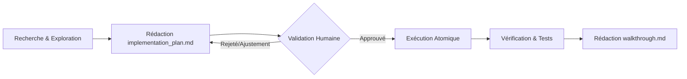

# SOP-IA-02 : Guide Expert Antigravity IDE, Subagents & Écosystème

**Catégorie :** IA & Ingénierie  
**Public cible :** Développeurs Fullstack, Tech Leads Minerva  
**Temps de lecture :** 30 minutes  
**Auteur :** Équipe Technique Minerva  

---

## 1. Architecture Globale d'Antigravity IDE

**Google Antigravity (AGY)** est un environnement de développement agentique conçu pour la programmation en binôme humain-agent et l'exécution de tâches autonomes de grande envergure.

```
┌─────────────────────────────────────────────────────────────────┐
│                      ANTIGRAVITY RUNTIME                        │
│                                                                 │
│  ┌──────────────────────┐        ┌────────────────────────────┐ │
│  │   Primary Agent      │◄──────►│    Knowledge Items (KI)    │ │
│  │   (Planner & Lead)   │        │    (Project Patterns & DB) │ │
│  └──────────┬───────────┘        └────────────────────────────┘ │
│             │                                                   │
│   ┌─────────┴─────────┐                  ┌────────────────────┐ │
│   ▼                   ▼                  │    Subagents       │ │
│ ┌───────────────┐   ┌────────────────┐   │  ┌──────────────┐  │ │
│ │ Planning Mode │   │ Slash Commands │──►│  │ Coding Agent │  │ │
│ │ (Plan/Review) │   │ (/goal, etc.)  │   │  ├──────────────┤  │ │
│ └───────────────┘   └────────────────┘   │  │ Browser Agent│  │ │
│                                          │  └──────────────┘  │ │
│                                          └────────────────────┘ │
└─────────────────────────────────────────────────────────────────┘
```

### Composants Majeurs :
1. **Primary Agent (Lead Agent)** : Responsable du dialogue avec le développeur, de la recherche, de la planification et de l'orchestration des tâches.
2. **Subagents Spécialisés** : Agents autonomes instanciés pour des tâches ciblées (exploration de codebase, rédaction de tests, scraping ou validation UI dans le navigateur via `browser_subagent`).
3. **Knowledge Items (KI)** : Système de mémoire institutionnelle (`<appDataDir>\knowledge`) résumant les patterns éprouvés et évitant le travail redondant.
4. **Customisations Root** : Système hiérarchique de règles (`AGENTS.md`, `rules/`), compétences (`skills/`) et plugins (`plugins/`).

---

## 2. Commandes Slash & Protocoles Avancés

Les commandes slash sont des déclencheurs de modes opératoires spécifiques :

### `/grill-me` (Alignement Architectural Préalable)
- **Objectif** : Conduire une interview interactive pointilleuse avant de toucher au code pour lever toute ambiguïté architecturale.
- **Protocole** :
  1. L'agent explore la codebase pour répondre lui-même à ce qui est vérifiable.
  2. L'agent pose les questions bloquantes une par une via `ask_question`.
  3. Chaque question propose une option recommandée `(Recommended)` formulée comme la réponse directe du développeur.
  4. Dès consensus, l'agent génère le plan d'implémentation.

### `/goal` (Exécution Autonome Complète)
- **Objectif** : Lancer un agent en mode objectif jusqu'à résolution complète sans interruption prématurée.
- **Usage idéal** : Tâches de refactoring de fond, mise à niveau de dépendances ou couverture de tests E2E exhaustive.

### `/learn` (Persistance des Apprentissages)
- **Objectif** : Enregistrer une règle de comportement ou une solution à un bug complexe pour qu'elle devienne une règle permanente dans la mémoire de l'agent.

### `/schedule` (Gestion des Timers et Cron Jobs Asynchrones)
- **Objectif** : Programmer des vérifications périodiques (monitoring de build, pooling de statut de déploiement) ou des rappels temporisés.

---

## 3. Subagents & Browser Subagent

Antigravity permet de déléguer des sous-tâches lourdes sans saturer la fenêtre de contexte de l'agent principal.

### Le Browser Subagent (`browser_subagent`)
L'agent dispose d'une instance Chromium intégrée capable de :
- Naviguer sur l'application locale (`http://localhost:3000`)
- Cliquer, remplir des formulaires et vérifier les flux d'authentification
- Enregistrer des vidéos d'interactions (format WebP) et capturer des captures d'écran
- Détecter les erreurs de console et les régressions visuelles

```typescript
// Exemple de flux délégué au Browser Subagent :
// 1. Démarrer le serveur dev (npm run dev)
// 2. Lancer le Browser Subagent avec la tâche :
//    "Se connecter avec un compte admin, naviguer sur /academy,
//     créer un nouveau SOP et vérifier son apparition dans la liste."
```

---

## 4. Planning Mode & Cycle de Livraison

Le **Planning Mode** impose un cadre strict pour toutes les tâches complexes :



### Règles Non-Négociables du Planning Mode :
1. **Interdiction de modifier le code pendant la phase de recherche** : Aucune commande modifiante ne doit être lancée avant validation du plan.
2. **`implementation_plan.md`** : Documente l'analyse, les questions ouvertes, les composants modifiés/créés/supprimés et le plan de vérification.
3. **`walkthrough.md`** : Généré en fin de tâche avec la liste exacte des modifications, les résultats des tests et les instructions de vérification visuelle.

---

## 5. Système de Customisations (Skills & Rules)

### 1. Custom Rules (`AGENTS.md` & `GEMINI.md`)
Les règles placées à la racine du dépôt s'appliquent immédiatement à chaque prompt de l'agent :
- Spécificités Next.js 16 App Router
- Conventions de style Minerva (pas de modals pour les formulaires, palette v3, Playfair Display)
- Règle stricte *Real Data Only*

### 2. Custom Skills (`.agents/skills/<nom_skill>/SKILL.md`)
Un Skill est un dossier contenant des instructions spécialisées et des scripts réutilisables :
```markdown
---
name: supabase-best-practices
description: Règles de sécurité RLS, migrations SQL et indexation Postgres pour Supabase.
---
# Instructions du Skill...
```

---

## 6. Playbook Opérationnel Antigravity chez Minerva

Pour toute nouvelle feature dans l'application :
1. **Étape 1** : Lancer `/grill-me` avec l'énoncé du besoin.
2. **Étape 2** : Valider les choix de design et le `implementation_plan.md`.
3. **Étape 3** : Laisser l'agent exécuter les modifications de manière atomique.
4. **Étape 4** : Exécuter `npx tsc --noEmit` et les tests Playwright via l'agent.
5. **Étape 5** : Vérifier le `walkthrough.md` et pusher la branche.
