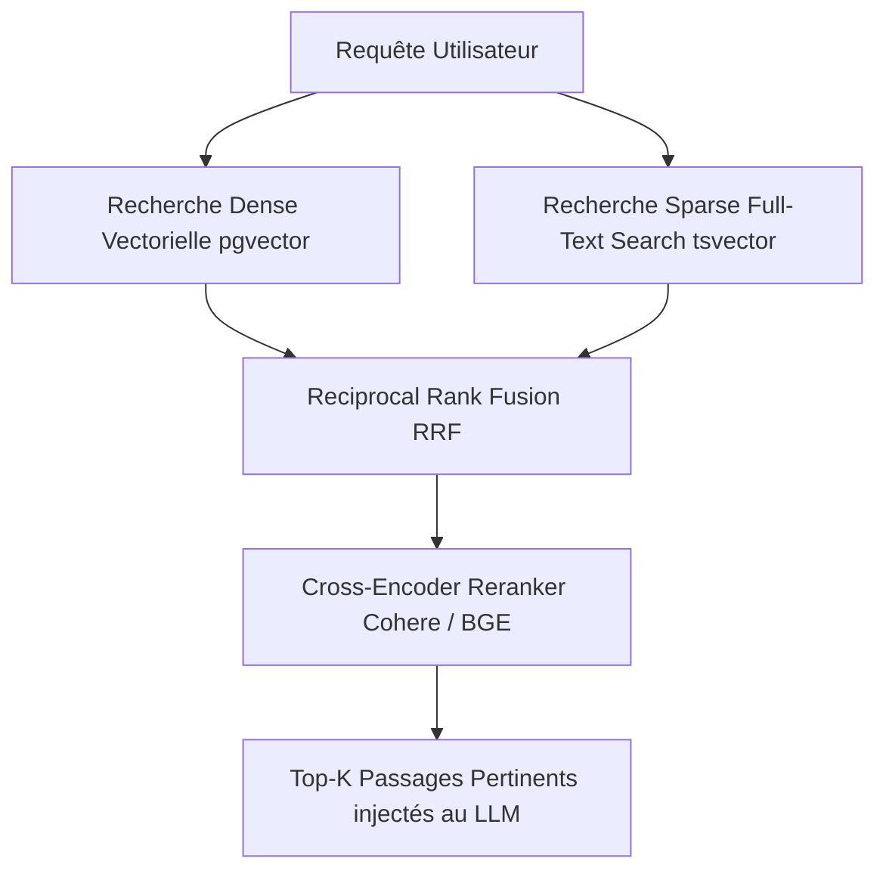

# SOP-IA-06 : RAG Avancé, Vector Search & Stratégies Hybrides

**Catégorie :** IA & Ingénierie  
**Public cible :** Ingénieurs IA, Développeurs Backend, Architectes Data  
**Temps de lecture :** 25 minutes  
**Auteur :** Équipe Technique Minerva  

---

## 1. L'Arbre de Décision : In-Context vs RAG vs Fine-Tuning

Lors de la conception d'une fonctionnalité intelligente pour Minerva (recherche d'audits, assistant de SOPs, génération de propositions), choisir la mauvaise approche entraîne coûts exorbitants et mauvaise maintenabilité.

```
                  ┌────────────────────────────────────────┐
                  │ Le modèle a-t-il besoin de nouvelles   │
                  │ connaissances ou d'un style spécifique?│
                  └──────────────────┬─────────────────────┘
                                     │
                 ┌───────────────────┴───────────────────┐
                 ▼                                       ▼
       [Nouvelles Données]                       [Style / Format Fixe]
                 │                                       │
        ┌────────┴────────┐                              ▼
        ▼                 ▼                       [FINE-TUNING]
 [Volumétrie < 100k] [Volumétrie > 100k]       (Apprentissage de style,
        │                 │                     grammaire spécifique)
        ▼                 ▼
  [IN-CONTEXT]          [RAG]
 (Prompt injection) (pgvector + Hybride)
```

| Approche | Coût Setup | Fraîcheur des Données | Hallucinations | Cas Idéal |
| :--- | :--- | :--- | :--- | :--- |
| **In-Context Prompting** | Nul | Temps réel | Faible si guidé | Résumé de réunion, scoring ponctuel |
| **RAG (Retrieval Augmented)** | Modéré | Temps réel (mise à jour DB instantanée) | Très faible (ancrage contextuel) | Recherche documentaire, base de SOPs, audits |
| **Fine-Tuning** | Élevé | Figé à la date du training | Moyen | Modèle spécialisé de classification ultra-rapide |

---

## 2. Implémentation de `pgvector` sous Supabase

Supabase supporte nativement l'extension PostgreSQL `vector` pour stocker et requêter des embeddings haute dimension.

### 1. Activer l'extension et créer la table vectorielle
```sql
-- Activer pgvector
CREATE EXTENSION IF NOT EXISTS vector;

-- Table de stockage des documents et embeddings
CREATE TABLE IF NOT EXISTS public.document_embeddings (
    id UUID PRIMARY KEY DEFAULT gen_random_uuid(),
    document_id UUID REFERENCES public.documents(id) ON DELETE CASCADE,
    content_chunk TEXT NOT NULL,
    metadata JSONB DEFAULT '{}'::jsonb,
    embedding vector(1536) -- 1536 pour text-embedding-3-small / ada-002, 768 pour nomic/gemini
);

-- Index HNSW (Hierarchical Navigable Small World) pour recherche ultra-rapide
CREATE INDEX IF NOT EXISTS document_embeddings_hnsw_idx 
ON public.document_embeddings 
USING hnsw (embedding vector_cosine_ops);
```

### 2. Fonction RPC PostgreSQL pour la recherche par similarité cosinus
```sql
CREATE OR REPLACE FUNCTION match_documents(
    query_embedding vector(1536),
    match_threshold FLOAT,
    match_count INT
)
RETURNS TABLE (
    id UUID,
    document_id UUID,
    content_chunk TEXT,
    metadata JSONB,
    similarity FLOAT
)
LANGUAGE plpgsql
AS $$
BEGIN
    RETURN QUERY
    SELECT
        de.id,
        de.document_id,
        de.content_chunk,
        de.metadata,
        1 - (de.embedding <=> query_embedding) AS similarity
    FROM public.document_embeddings de
    WHERE 1 - (de.embedding <=> query_embedding) > match_threshold
    ORDER BY de.embedding <=> query_embedding
    LIMIT match_count;
END;
$$;
```

---

## 3. Stratégies de Chunking & Découpage Sémantique

Le découpage du texte source conditionne directement la pertinence de la recherche :

1. **Taille de Chunk Optimale** :
   - Pour la recherche de précision : Chunks de **256 à 512 tokens** avec un overlap de **10-15%**.
   - Trop grand (> 1000 tokens) : dilution du signal sémantique.
   - Trop petit (< 100 tokens) : perte du contexte environnant.
2. **Chunking Conscient de la Structure (Markdown-aware)** :
   - Découper en priorité au niveau des titres (`#`, `##`, `###`) et des blocs de code plutôt que sur des coupures de caractères aveugles.
3. **Enrichissement de Métadonnées** :
   - Préfixer chaque chunk avec le titre du document parent et sa catégorie métier (ex: `[Académie Minerva > SOP Outils] Contenu du paragraphe...`).

---

## 4. RAG Avancé : Recherche Hybride (Dense + Sparse) & Reranking

Pour surmonter les faiblesses de la recherche vectorielle pure (difficulté sur les acronymes, IDs exacts ou noms propres), Minerva préconise la **Recherche Hybride** combinant Recherche Plein Texte (PostgreSQL FTS) et Similarité Cosinus via **Reciprocal Rank Fusion (RRF)**.



### Formule RRF :
$$RRF\_Score(d) = \sum_{m \in M} \frac{1}{k + rank_m(d)}$$
*(avec $k \approx 60$ par défaut)*

---

## 5. Évaluation des Systèmes RAG (Framework RAGAS)

Tout pipeline RAG déployé chez Minerva doit être évalué selon trois métriques fondamentales :

1. **Faithfulness (Fidélité)** : La réponse générée est-elle intégralement appuyée par le contexte récupéré sans invention ?
2. **Answer Relevance (Pertinence de la Réponse)** : La réponse répond-elle directement à l'intention de l'utilisateur ?
3. **Context Precision (Précision du Contexte)** : Les chunks les plus pertinents étaient-ils classés aux premiers rangs du retrieval ?
